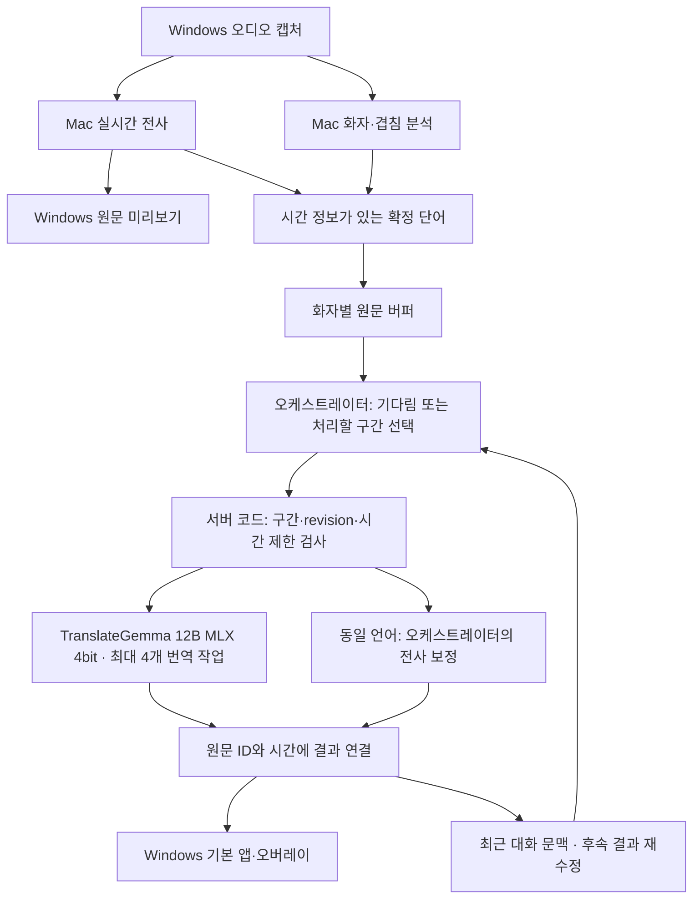

# TranslateGemma MLX와 화자별 번역 오케스트레이터

설계 기준: 2026-09-16, Windows 클라이언트 + 같은 LAN의 Mac Studio M4 Max 64GB.

## 권장 구성

**오케스트레이터 1개 + TranslateGemma 번역 작업 최대 4개**로 구성한다. 번역 작업 수와 메모리에 로드하는 모델 인스턴스 수는 별도 설정이다.



### 역할 분담

| 구성 요소 | 담당 |
|---|---|
| ASR | 음성을 실시간으로 전사하고 단어 시각과 안정화 여부를 제공한다. |
| 화자 분석 | 음성 특징으로 화자 신원·겹침 여부를 판단한다. 텍스트 모델이 화자를 추측하지 않는다. |
| 서버 버퍼·작업 큐 | 화자별 원문·시간·revision을 보관하고 중복·잘못된 구간·오래된 응답을 차단한다. |
| 오케스트레이터 | 해당 화자의 원문과 최근 대화를 보고 번역할 수 있는 연속 앞부분을 선택한다. 아직 부족하면 기다린다. |
| TranslateGemma | 선택된 원문만 목표 언어로 번역한다. 작업 배분·화자 식별·JSON 판단은 맡기지 않는다. |
| 결과 처리 | 어떤 모델이 먼저 끝나도 원래 자막 ID에 붙인다. 후속 수정은 같은 ID의 결과 revision을 올린다. |

오케스트레이터 모델이 직접 파일·네트워크 도구를 실행할 필요는 없다. 모델은 짧은 판단 JSON을 반환하고, 실제 스케줄링은 서버 코드가 수행한다.

## 사용할 모델

### 번역: TranslateGemma 12B IT MLX 4bit

Google의 TranslateGemma는 직접 번역에 맞춘 모델이다. 공식 카드에는 전용 언어 입력 형식과 2K 입력 문맥이 명시되어 있다. 범용 채팅 프롬프트에 구간 선택·JSON 출력·원문 보정을 한꺼번에 맡기는 것은 공식 사용 경로와 다르다. 따라서 번역 전용 입력을 별도 어댑터로 구성한다. [Google 모델 카드](https://huggingface.co/google/translategemma-12b-it/blob/main/README.md)

### 오케스트레이터 후보: Qwen3-4B-Instruct-2507 MLX 4bit

작은 모델부터 구간 선택 정확도와 지연을 확인한다. 이 Qwen 버전은 긴 사고 과정을 생성하지 않는 비추론형이며, 지시 따르기·텍스트 이해·다국어 처리 개선을 목표로 한 모델이다. 이 특성을 근거로 초기 후보로 선택했으며 MyVote의 실제 구간 선택 품질을 검증했다는 뜻은 아니다. [Qwen 공식 설명](https://huggingface.co/Qwen/Qwen3-4B-Instruct-2507)

LM Studio에서 찾을 MLX 변환 모델: [mlx-community/Qwen3-4B-Instruct-2507-4bit](https://huggingface.co/mlx-community/Qwen3-4B-Instruct-2507-4bit). 우선 문맥 길이 4,096부터 설정하고 실제 요청 길이에 따라 조정한다. 이는 앱 운용 시작값이며 모델의 최대 문맥 길이가 아니다.

## 4개 병렬 처리 방식

### 우선 권장: TranslateGemma 한 번 로드, 동시 작업 4개

LM Studio는 2026-06-05 공식 글에서 MLX 엔진 1.8.5의 연속 배치 처리와 `parallel=4` 사용 사례를 공개했다. 따라서 예전 문서의 “MLX는 추후 지원” 안내만으로 현재 지원 여부를 판단하면 안 된다. 설치한 런타임과 TranslateGemma 조합에서 실제로 동시 처리가 되는지 확인해야 한다. [LM Studio MLX 안내](https://lmstudio.ai/blog/mlx-engine-agentic-workloads)

- 같은 TranslateGemma 인스턴스 ID를 번역 큐의 최대 4개 작업이 공유한다.
- 화자 A를 항상 작업자 1에 묶지 않는다. 화자별 문맥은 서버가 관리하고, 준비된 작업은 비어 있는 슬롯으로 보낸다.
- 다른 화자의 독립 구간은 병렬 처리할 수 있다. 같은 화자 버퍼의 다음 판단은 앞 구간 처리가 끝난 뒤 진행해 문맥 순서를 유지한다.
- 동시 작업 1·2·4개를 비교해 자막 지연이 가장 낮은 설정을 선택한다. 처리량 증가와 개별 자막 지연 감소는 다른 지표다.

### 4개 모델 인스턴스를 로드하는 구성

사용자가 원하는 4개 인스턴스 구성도 서로 다른 모델 ID 4개로 연결한다. 각 인스턴스에 작업 하나씩 배정한다. 같은 원문을 4개 모델에 복제해 번역하는 방식은 사용하지 않는다.

예시 MLX 배포의 파일 크기는 약 6.66GB다. 네 인스턴스가 가중치를 각각 가진다고 가정하면 단순 가중치 규모만 약 26.6GB에 해당하고, 여기에 실행 메모리·문맥 캐시·ASR·화자 분석·오케스트레이터·macOS가 추가된다. 이것은 실제 RAM 사용량 측정값이 아니다. [해당 MLX 배포 파일 목록](https://huggingface.co/mlx-community/translategemma-12b-it-4bit/tree/main)

M4 Max 하나의 GPU와 메모리 대역폭을 함께 쓰기 때문에 4개 인스턴스가 4배 빠르다고 볼 수 없다. 64GB에 들어가는지뿐 아니라 메모리 압력, swap 증가와 전사 지연도 함께 측정한다.

## 화자별로 원문을 쌓는 규칙

1. 단어마다 원문 ID, 전사 revision, 시작·끝 시각, 음성 트랙과 캡처 epoch를 보관한다.
2. 확정된 음성 화자 ID가 있으면 해당 화자의 버퍼로 보낸다.
3. 미확정 음성은 발화별 임시 버퍼로 둔다. 모든 `미확정`을 한 사람으로 합치지 않는다.
4. 화자가 바뀌면 이전 구간에 마감 경계를 남긴다. A → B → A에서 두 A 발화를 이어 B 구간까지 덮는 자막을 만들지 않는다.
5. 뒤늦게 화자가 확인되면 기존 자막의 화자 라벨을 갱신할 수 있다. 이미 요청한 번역의 원문을 다른 버퍼로 몰래 옮기지 않는다.
6. 동시에 겹친 혼합 전사는 임의로 두 화자에게 분배하지 않는다. 기존 음원 분리·분리 음성 재전사의 검증된 결과로 자막 그룹을 교체한다.

화자 판단이 전사보다 늦거나 아직 미확정이면 초기 번역은 임시 버퍼에서 진행한다. 화자 확정이 끝날 때까지 모든 번역을 멈추지는 않는다.

## 구간 선택 예시

입력이 `제가 어제 / 확인해 보니 / 그 파일이 없었습니다 / 그래서`까지 들어왔다면 모델은 첫 단어부터 `없었습니다`까지 선택할 수 있다. 서버는 그 ID 범위의 원문을 정확히 추출해 TranslateGemma에 전달하고 `그래서`는 남긴다. 요청 중 새로 전사된 말도 다음 버퍼에 남는다.

오케스트레이터의 응답은 다음 두 가지다.

```json
{"action":"wait"}
```

```json
{"action":"commit","through_id":"u24"}
```

선택은 해당 버퍼의 첫 단어부터 기존 ID까지 이어져야 한다. 모델이 ID를 만들거나 중간 단어를 건너뛰면 서버가 거부한다. 번역 결과에도 원문 구간 ID가 유지되므로 작업 완료 순서가 바뀌어도 다른 화자의 자막에 붙지 않는다.

## 대기 상한과 후속 수정

- 일반 판단은 최소 0.8초 간격으로 시작한다. 여러 화자의 판단은 오케스트레이터 한 개에 순서대로 들어간다.
- 수집 대기 4초 또는 발화 종료에서 마감을 요청한다.
- 두 단계 요청은 기본 최대 3.5초다. 오케스트레이터 선택은 1초, 번역은 최대 2.5초이며 대기열 시간도 포함한다. 첫 확정 단어부터 전체 8초 상한이 우선한다.
- 시간 초과·모델 형식 오류에서는 원문을 보존한다. 문장이 완벽해질 때까지 계속 기다리지 않는다.
- 첫 자막을 우선 처리하고, 후속 재검토는 대기 중인 첫 자막이 없을 때 실행한다.
- 후속 문맥 수정은 작은 오케스트레이터 모델의 검토 결과를 사용한다. 원래 발언을 바꾸는 오류가 있는지 별도 평가가 필요하다.

위 수치는 초기 처리 정책이다. Mac·실제 모델에서 측정한 지연 목표 달성 결과가 아니다.

## 실제 Mac에서 비교할 항목

동일 영상·구간으로 번역 동시성 1 → 2 → 4를 비교한다. ASR 설정과 언어는 유지한다.

| 항목 | 확인하는 문제 |
|---|---|
| 음성 끝 → 원문 표시 | 번역 부하 때문에 전사가 늦어지는지 |
| 음성 끝 → 번역 표시의 중앙값·p95 | 평소 지연과 느린 경우의 지연 |
| 모델 wait·timeout·JSON 오류 비율 | 오케스트레이터가 적절한 구간을 제때 고르는지 |
| 자막 길이·교체 간격 | 짧은 어절 자막 문제가 줄었는지 |
| 화자 오부착·겹침 원문 누락 | 잘못된 화자 버퍼로 보냈는지 |
| 메모리 압력·swap | 동시성을 늘리면서 메모리가 부족해지는지 |

그 결과를 보고 4개 논리 작업 유지, 동시 작업 축소, 또는 별도 인스턴스 4개 구성 중 하나를 선택한다.
