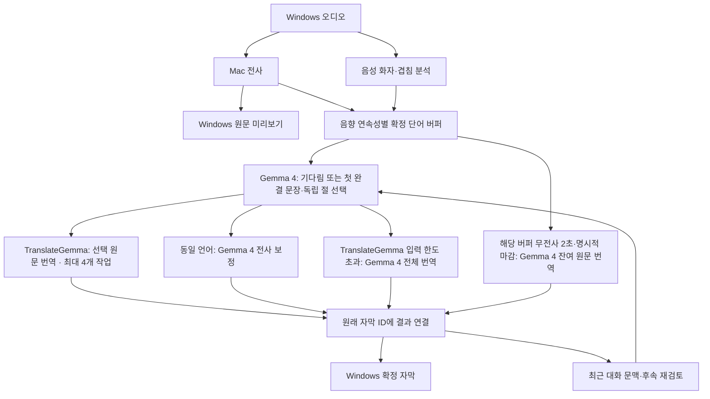

# MyVote Mac 서버

Windows의 재생 음성을 받아 전사·화자 분석·의미 구간 번역을 수행하는 Mac 서버 프로젝트다. [최신 업데이트 안내](SERVER_UPDATE_KO.md)와 [번역 오케스트레이터 구조](translation-orchestrator-architecture.md)를 기준으로 운영한다. [first-demo.md](first-demo.md)는 최초 환경을 준비할 때의 안내다.

공개 문서의 Mac 주소 `192.0.2.10`과 Windows 주소 `192.0.2.20`은 **문서 전용 예시**이며 실제 접속 주소가 아니다. 개인 경로는 `$HOME`·`%USERPROFILE%` 기준으로 표기한다. 아래 운영 측정 기록은 유지하되 주소·경로는 공개용으로 바꿨다. 실제 운영 설정 `server.toml`은 Git에서 제외하며, 새 환경에서는 [server.example.toml](server.example.toml)을 복사해 실제 LAN 주소를 입력한다. [Git 공개 범위와 복제 후 준비](docs/git-publishing.md)를 먼저 확인한다.

## 현재 준비 상태

적용 대상은 **`semantic-translation-2026-09-16`**이다. 새 `MyVote-Speaker-Update.zip`을 프로젝트의 `./MyVote-Speaker-Update`에 전체 압축 해제했고, manifest 대상 **77개 파일**과 ZIP의 **78개 파일**을 확인했다. ZIP SHA256은 다음과 같다.

```text
5b9214bbc3ee407fb405d34282e1421e5b6ef7e8ab139a82115aabbeb87c0605
```

기존 `MyVote-Mac-Demo/.venv`, `models`, `connection`과 겹침 분리용 `pytorch_model.bin`을 재사용한다. 업데이트 ZIP은 새 서버 소스를 공급하며 Python 환경·모델·인증서는 기존 데모 폴더에서 가져온다.

LM Studio에는 **TranslateGemma 12B IT MLX 4bit**를 문맥 **2048**, 동시 처리 **4**로 로드했고, 기존 **Gemma 4 26B A4B MLX 4bit**를 문맥 **262144**, Thinking OFF로 유지했다. 두 모델의 역할과 실행 설정은 아래 표를 따른다.

**의미 우선·무전사 잔여 처리 정책을 적용해 서버를 재시작했다.** 확인 시 Python PID `74146`이 운영 LAN 주소의 50051번에서 mTLS를 수신했다(문서 예시 `192.0.2.10:50051`). 시작 로그에서 `complete-prefix-inactivity-v3`, 2000ms 무전사 기준, 절 단위 재확인과 아래 프롬프트 해시를 확인했다. 완결 문장·독립 완결절을 먼저 처리하고, 화자별 버퍼에 새 전사가 2초간 없으면 잔여 원문을 별도로 번역한다. **첫 단어부터 2초 안에 화면에 표시한다는 SLA가 아니다.** LM Studio LAN API의 문서 예시는 `192.0.2.10:1234`이며 두 모델 로드 설정은 유지한다.

검증된 업데이트 트리의 manifest 대상 77개 파일과 그 안의 원본 문서는 변경하지 않았다. 최상위 공개 안내문은 주소·개인 경로만 예시화했다. 새 자동 회귀 **268/268개**, 별도 텍스트 API **94/94개**, 실제 모델 통합 시나리오 **7/7개**와 긴 원문 마감 **2/2개**를 통과했다. 선택기 단독 고정 입력 **48/50건**과 남은 차이는 아래에 별도로 기록했다. 재시작 준비 추론은 ASR **1326ms**, 번역 **400ms**, 전체 **1794ms**로 완료했다. 모두 Windows 실제 영상·화면 표시 검증과는 구분한다. 기존 의미 구간 클라이언트의 코드 수정은 필요 없으며, 새 서버에 재연결해 실제 영상을 확인해야 한다.

### 번역 누락 재현과 수정 범위

연결과 모델 로드는 정상이었다. 재현에서는 약 0.32초의 짧은 정적을 VAD가 발화 종료(`endpoint`)로 판단하면서 같은 화자 문장의 수량과 단위가 나뉘었다. 서버가 그 경계를 고정해 두 조각을 함께 보지 못했고, 완결성 검사는 각각을 미완성으로 판단해 모두 원문만 남겼다.

품질 우선 모드에서 번역 버퍼는 **화자 이름이 없는 연속 발화 키**를 쓴다. `확정 A → 잠깐 미확정 → 확정 A`만으로 문장을 세 조각 내지 않는다. VAD 재연결은 같은 트랙·캡처 구간·언어·세대 번호, 중간 경로 변경 없음, 실제 단어 간격 **0~1.5초**, 정확한 대기 버퍼 끝 ID라는 조건을 유지한다. 대기 원문과 새 단어의 음향 근거에 확정 화자 충돌·겹침·모호한 신원·보관 기간 만료가 있으면 연결하지 않는다.

강제 마감·오디오 단절·전체 기한 만료·확정된 다른 화자는 계속 분리한다. **미확정을 직전 화자로 지정하지 않으며**, 자막 화자명은 기존 음향 판정기가 그대로 결정한다. 단점은 음향으로 감지되지 않은 실제 화자 변경이 하나의 번역 문맥에 들어갈 수 있다는 것이다. 일반 경계 선택은 미완성을 기다리며, 새 정책의 무전사·명시적 마감 잔여 번역은 완결 판정과 구분한다.

## Gemma 4 의미 우선·무전사 잔여 처리 정책

[gemma4-semantic-boundary-prompt_latest.md](gemma4-semantic-boundary-prompt_latest.md)는 원문 그대로 보관하고 롤백 기준으로 사용한다. 로더는 **1절 시스템 프롬프트 전체**를 읽으며 문서 후반의 SHA256 코드 블록은 제외한다. 이전 `gemma4-semantic-boundary-prompt.md`도 보관만 한다.

새 설정은 `lmstudio.semantic_quality_first = true`, **`semantic_low_latency = true`**, **`semantic_inactivity_flush_s = 2`**를 사용한다. `semantic_boundary_refinement = true`와 기존 문서·TranslateGemma/Gemma 4·JSON 호환 설정이 필요하다. [전용 적용 모듈](scripts/gemma_boundary_prompt.py)이 선택 함수의 **system 내용만 첫 완결 구간 우선 프롬프트로 교체**한다. 기존의 가장 긴 완성 앞부분 규칙을 덧붙여 섞지 않는다. 입력 구조·원문·unit ID·선택 파서·일반 TranslateGemma 프롬프트·후속 검토, `temperature=0`, 선택 출력 최대 128토큰, Thinking OFF는 유지한다.

완전한 문장·질문·명령 또는 **독립적인 완결절의 첫 안전 경계**를 선택한다. 문장이 계속되더라도 그 절의 의미가 독립적으로 완성되었다면 종결어미·문장 끝까지 기다리지 않는다. 완성 문장이 여러 개면 첫 구간부터 처리하며, 명사구·미완성 절·빠진 조건이나 단위가 있는 구절은 다음 입력을 기다린다. 짧은 생략형 답은 명확한 관련 질문에 완전하게 답할 때만 허용하고 **최소 단어 수나 고정 단어 개수로 자르지 않는다.** 이미 이어진 조건·대조·부정·필수 이유는 잘라내지 않는다. 한국어 `-고`도 완결 서술이면 선택할 수 있지만 `-고 싶다`처럼 뒤 보조서술이 필요한 경우는 분리하지 않는다.

새 전사가 **해당 화자 버퍼에 2초간 없거나 명시적인 강제 마감이 오면**, 남은 원문을 Gemma 4의 별도 잔여 처리 경로로 번역한다. 미완성을 완성 문장으로 오인한 것이 아니며 누락된 내용·단위·조건을 지어내지 않고 주어진 원문만 처리하도록 요청한다. 다른 화자의 전사는 이 버퍼의 타이머를 갱신하지 않는다. 2초는 번역 시작 조건이며 모델 대기·추론·전달·화면 표시 시간은 추가된다.

원본 문서의 **5,061자** 시스템 프롬프트는 그대로 보존한다. 새 첫 완결 구간 우선 프롬프트는 **8,896자**이고, 이전 품질 우선 프롬프트 5,323자도 `semantic_low_latency=false`의 복귀 기준으로 유지한다.

```text
원본: 2e04a944d0de4b642acc5b9f5ce15c0e7b35b0bcffe22133c25822881b925fa8
이전 품질 우선: a7ff22e956ac7bf234ccb0edc2fff46fcefc643d7f88db7c5d1f101515f4d605
새 첫 완결 구간 우선: a92c32b8a1783ecd3a63e0e549246bbcd7c1067b434ef94414eb674c93e7a7a8
```

재시작 로그의 `semantic_boundary_prompt_sha256`가 위 새 해시와 일치했다. 원본 문서 해시는 `semantic_boundary_base_sha256`, 정책은 `semantic_boundary_prompt_policy=latency-balanced-complete-thought-v1`이다. LM Studio 채팅 화면의 전역 프롬프트를 바꾼 것은 아니므로, Windows에서 API를 직접 호출할 때는 호출자가 같은 system 메시지를 보내야 같은 조건으로 비교할 수 있다.

최종 `a92c…` 프롬프트의 실제 선택기 고정 입력은 **48/50건**이 기대 ID와 일치했다. 새로 추가한 종결부호 없는 영어 완결문·영어 `and` 독립절·한국어 `끝났고` 독립절·한국어 `가고 싶어요` 보조서술 보존 **4건은 모두 통과**했다. 초기에는 한국어 `-고`에서 기다렸으며, 직전 `6adda…` 본문의 44/46건 이후 설명·긍정 사례를 보완한 개발 회귀 결과다.

남은 두 차이는 완결 문장 두 개를 첫 문장만 선택하지 않고 함께 선택한 경우와, `보고서는 준비됐지만 검토는 끝나지 않았어요.`를 기다린 경우다. 이 고정 진단에서는 위험한 조기 분리가 관측되지 않았지만 **항상 첫 완결 경계를 선택한다는 보장은 없다.** 새 무전사 잔여 경로는 전사가 멈춘 뒤 계속 기다리는 상황을 제한하며, 번역 성공이나 2초 이내 화면 표시를 보장하지 않는다. 과거 품질 프롬프트의 46/46건·230.4~448.0ms는 별도 결과다. 프롬프트 예시를 포함한 고정 개발 입력은 독립 정확도 평가나 실제 영상 개선 보장을 대신하지 않는다.

### 원문 버퍼 경계 처리

`semantic_boundary_refinement`는 실행기의 환경 전달을 거쳐 [게이트웨이](scripts/gemma_update_gateway.py)에서 [버퍼 라우팅 보완](scripts/semantic_boundary_routing.py)과 [파이프라인 보완](scripts/semantic_boundary_pipeline.py)을 설치한다. `semantic_quality_first`는 여기에 [완성도 우선 대기 정책](scripts/semantic_quality_policy.py)을 적용한다. 원본 ZIP·문서·manifest 대상 77개 파일은 수정하지 않는다.

- ASR의 `max_window` 종료를 의미 구간의 강제 마감으로 취급하지 않는다. ASR 자체의 확정·미확정 단어 처리 방식은 유지한다.
- PCM 전송만 멈추고 RPC 연결이 열린 경우에는 [전사 무입력 보완](scripts/semantic_transcript_idle.py)이 **PCM과 새 전사 변화가 모두 2초간 없고 ASR이 쉬는 상태**인지 확인한다. `builder.flush(reason="transcript_inactivity")`를 정규 ASR final 경로로 보내고 해당 버퍼만 잔여 처리한다. 미확정 단어를 임의로 확정 승격하거나 다른 화자와 합치지 않는다.
- 미확정 화자 버퍼는 같은 트랙·캡처 구간·언어에서 시각이 정확히 이어지는 창임을 확인했을 때만 이어 쓴다. 실제 오디오 단절·과부하로 생긴 누락 전후는 별도 세대 번호로 구분하며, 이전 대기 창과 최근 대화 문맥을 새 구간에 섞지 않는다.
- 발화 종료(`endpoint`)나 화자 변경은 해당 버퍼만 자연 마감한다. `force_flush=false`로 준비된 앞부분을 선택하거나 기다릴 수 있게 한다. 품질 우선 모드의 VAD 종료만 위 음향·연속성 조건을 모두 만족하면 다시 연결하며, 화자 변경 경계나 다른 화자 버퍼는 함께 해제하지 않는다.
- 품질 우선 모드에서는 화자 판정 부족과 실제 변경·겹침 증거를 구분한다. 전자는 익명 연속 버퍼를 유지할 수 있고 후자는 분리한다. 음향 조회는 배치 안에서 캐시하며 근거가 변경되면 다시 확인한다.
- 첫 의미 판단은 즉시 가능하며, 후속 요청만 화자 버퍼별 최소 0.25초 간격을 따른다. 같은 원문을 이 간격으로 반복 호출하지 않는다. `semantic_inactivity_flush_s=2`가 켜져 있으면 `semantic_max_hold_s=2`의 원문 나이 기준 재확인은 사용하지 않고, 해당 버퍼의 마지막 새 전사 시점부터 무입력을 센다. 전체 체류 제한 45초는 유지한다.
- 대기 용량은 원본 단어 최대 256개·4000자다. 모델 요청의 64개 단위 제한은 유지하되 긴 입력은 연속 단어들을 묶어 요청한다. 블록 끝의 실제 ID만 선택 가능하며, 원본 단어·시간·자막 소유권은 그대로 보존한다. 이 경우 선택 가능한 경계가 최대 4단어 단위로 보수적으로 바뀔 수 있다.
- 첫 선택이 `wait`이면 원문 단위 끝의 문장·절 부호를 기준으로 조각을 묶어 재확인한다. 원문·순서·전체 뒷부분을 그대로 전달하고, 각 묶음의 마지막 원본 ID만 선택할 수 있다. **부호 자체는 번역 허가가 아니며**, 모델이 조건·대조를 포함한 전체 입력을 다시 판단한다. 그래도 기다리고 원본 조각이 8개 이상이면 동일 원문 전체를 한 단위로 한 번 재확인한다(같은 한 단위 검사는 중복하지 않음). 최대 세 판단은 같은 5초 선택 기한을 공유한다. 최초 선택이 성공하면 재검사하지 않는다.
- 일반 경계 선택은 `force_flush=false`로 완결성 검사를 유지한다. 무전사 2초 또는 명시적인 강제 마감에서는 해당 원본 스냅샷을 별도 Gemma 4 잔여 번역 경로에 전달하며, 이때만 `force_flush=true`로 마지막 원본 ID까지 처리한다. 시간 초과·잘못된 응답·전체 체류 기한 초과 등 실패 시에는 원문을 보존한다.

전역 파서의 기존 `force_flush=true` 계약은 바꾸지 않는다. 명시적으로 `true`를 보내면 마지막 ID까지 처리해야 하며, 잔여 처리도 임의의 일부 ID나 다른 화자의 원문을 선택할 수 없다. 소스 단절·세대·취소·원본 소유권 검사는 두 경로에서 유지한다.

[출력 보호 모듈](scripts/semantic_quality_output.py)은 실패해 원문만 보존한 자막을 겹침 교체 대상으로 다시 등록하지 않는다. 겹침 분리 후 교체할 각 조각도 하나의 분할 불가 단위로 Gemma의 전체 완결성 검사를 통과해야 TranslateGemma로 번역한다. 조각 하나라도 미완성이면 그룹을 교체하지 않고 기존 자막을 유지한다. 기존 보조 작업의 `SECONDARY` 접수·부하 제한은 유지한다.

[클라이언트 안내 모듈](scripts/semantic_quality_gateway.py)은 활성화된 `session.started`에 후속 판단 간격 250ms·무전사 기준 2000ms·전체 체류 45000ms·선택 5000ms·번역 15000ms·공유 요청 예산 20000ms와 `semantic_incomplete_policy=translate_residual_after_inactivity`를 전달한다. 무전사 처리가 켜진 동안 `semantic_max_hold_ms=2000`은 원문 나이 기준 반복 판단 타이머가 아니다. 인증·세션 소유권 처리는 원본 게이트웨이가 맡는다.

**같은 화자 버퍼의 구간 선택과 번역은 아직 분리하지 않았다.** 기존 한 작업이 번역 완료까지 기다리는 구조를 유지하므로, 같은 버퍼의 다음 경계 판단도 앞 번역을 기다린다. 독립 화자 버퍼의 번역 작업 동시성 4와는 별개다.

설정 변경 후에는 서버를 재시작해야 한다. 롤백은 먼저 **`semantic_low_latency = false`, `semantic_inactivity_flush_s = 0`**으로 새 선택·잔여 처리 모드를 끈다. 그다음 `semantic_quality_first = false`로 바꾸면 품질 우선 프롬프트·대기 정책·출력 보호·클라이언트 안내를 끄고 **최신 문서 + READY_PREFIX_EXTENSION + 기존 경계 보완**으로 돌아간다. 원본 파이프라인까지 돌아가려면 이후 `semantic_boundary_refinement = false`로 설정하고, 문서 적용 자체도 끄려면 `semantic_boundary_prompt` 키를 제거한다. JSON schema 호환 설정은 별도다.

## 처리 구조



오케스트레이터는 일반 경로에서 처리할 원문 구간을 JSON으로 선택한다. 서버가 구간 ID·revision·시간 제한을 검사한 뒤 실제 원문만 TranslateGemma에 전달한다. 텍스트 모델이 음성 화자를 추측하거나 직접 도구를 실행하지 않는다. 미확정 화자는 음향 연속성·충돌 근거에 따라 익명 버퍼를 유지하거나 분리하며, 원문 미리보기는 확정 자막과 내보내기에 중복 저장하지 않는다.

| 역할 | 현재 설정 |
| --- | --- |
| 번역 프로필 (`lmstudio.translation_profile`) | `translategemma` |
| 번역 모델 ID (`lmstudio.model_id`) | `translategemma-12b-it` |
| 번역 문맥·동시성 | 2048 tokens, 모델 인스턴스 1개, LM Studio `parallel=4`, 논리 번역 작업 최대 4개 |
| 오케스트레이터 모델 ID (`lmstudio.orchestrator_model_id`) | `google/gemma-4-26b-a4b` |
| 오케스트레이터 문맥·동시성 | 262144 tokens, Thinking OFF, 요청 동시성 1 |
| 동일 언어 보정·후속 문맥 재검토 | Gemma 4 담당 |

구조 문서의 Qwen3-4B-Instruct-2507은 초기 후보다. 이 Mac에서는 **기존 Gemma 4를 유지한다는 사용자 선택**에 따라 오케스트레이터로 사용한다. TranslateGemma는 번역 전용 입력 형식을 사용하며 모델 ID만 바꿔 범용 채팅 프롬프트를 보내지 않는다. [Google TranslateGemma 모델 카드](https://huggingface.co/google/translategemma-12b-it/blob/main/README.md)

4개 번역 작업은 같은 모델 인스턴스를 공유한다. 각 화자를 특정 작업자에 고정하지 않으며, 결과가 완료되는 순서와 관계없이 원래 자막 ID에 연결한다. 이 Mac에서 짧은 입력의 동시 작업 1·2·4 비교를 수행했고, 실제 영상·ASR 동시 부하는 별도 검증이 필요하다. [LM Studio MLX 동시 처리 안내](https://lmstudio.ai/blog/mlx-engine-agentic-workloads)

### 대기·실패 정책

| 항목 | 품질 우선 정책 (`semantic_quality_first=true`) |
| --- | --- |
| 구간 판단 간격 | 첫 검사는 즉시, 화자 버퍼별 후속 요청만 최소 0.25초 |
| 원문 수집 | 완결 문장·독립 완결절은 먼저 처리, 미완성은 다음 전사 대기 |
| 무전사 잔여 처리 | 해당 버퍼에 새 전사가 2초간 없으면 Gemma 4로 잔여 원문 번역; 다른 화자는 타이머를 연장하지 않음 |
| 발화 종료·화자 변경 | 해당 버퍼만 자연 마감, `force_flush=false`; VAD 종료 후 같은 화자 재연결은 음향·연속성 조건 필수 |
| VAD 종료 후 재연결 간격 | 이전 마지막 단어와 새 첫 단어 사이 0~1.5초, 기한·강제 마감·화자 보호 유지 |
| 모델 요청 | 기본 총 20초: 구간 판단 최대 5초 + 번역 최대 15초, 각 단계 큐 대기 포함 |
| 원문 전체 체류 | 첫 단어의 서버 전사 확정부터 최대 45초 |
| 대기 원문 | 최대 256개 원본 단어·4000자, 모델 요청은 최대 64개 연속 블록 |
| 명시적 마감 시 미완성 원문 | 해당 경계 안의 잔여 원문을 Gemma 4로 번역; 실패하면 원문 보존 |
| 구간 판단의 앞 문맥 | 해당 버퍼의 완료 원문 2개와 최근 대화 2개 |

품질 우선 서버는 기존 클라이언트의 2.5초 설정 대신 위 의미 구간 요청 예산을 사용하고 실제 값을 `session.started`로 알린다. 남은 원문 전체 체류 시간이나 직접 호출자가 지정한 더 짧은 절대 기한은 넘지 않는다. 일시적 단계 시간 초과는 동일 ID·기한 안에서 한 번만 재시도한다. 형식 오류·잘못된 ID는 재시도하지 않는다. 중지 시 기본 세션 drain은 `원문 체류+번역 제한`을 수용하는 60초로 늘린다. 명시적으로 전달한 GatewayConfig 제한은 바꾸지 않으며 실제 값을 `semantic_finish_timeout_ms`로 알린다. 이 수치는 제한값이지 화면 표시 지연 보장값이 아니다.

일반 완결 구간 번역에서 TranslateGemma의 **프롬프트 UTF-8 바이트 수 + 최대 출력 토큰 수 ≤ 2048** 검사는 그대로다. 그 입력 한도를 넘는 완성 원문만 기존 Gemma 4의 일반 번역 API로 넘긴다(출력 상한 2048토큰, 기존 오케스트레이터 직렬 게이트 공유). 별도의 무전사·명시적 마감 잔여 경로는 길이와 관계없이 Gemma 4를 사용한다. 제어 토큰·잘못된 언어·잘린 모델 출력 검증은 우회하지 않으며 실패 시 원문은 보존한다.

`server.toml`의 `semantic_low_latency`, `semantic_min_request_interval_s`, `semantic_inactivity_flush_s`, `semantic_selection_timeout_s`, `semantic_translation_timeout_s`, `semantic_max_hold_s`, `semantic_total_age_s`로 경계 선택·접수 간격·보존 상한을 조정한다. `semantic_latency_target_s`는 새 운영 설정에서 제거하며, 무전사 2초와 첫 단어 표시 지연 목표를 혼동하지 않는다. 모델 요청 상한은 선택·번역 제한의 합이다. 변경 후 서버를 재시작해야 한다.

### Gemma JSON 호환 설정

`lmstudio.context_review_json_schema = true`는 프로젝트 소유의 [호환 실행기](scripts/start_update_with_compat.py)와 [JSON 호환 모듈](scripts/gemma_json_compat.py)을 사용한다. 기존 후속 문맥 재검토 JSON schema를 유지하고, 새 의미 구간 선택 `_SelectionProvider`에만 선택 응답 schema를 추가했다. TranslateGemma 번역 본문과 동일 언어 첫 보정은 각각의 기존 출력 형식을 사용한다.

원본 업데이트 ZIP·소스·manifest와 검증 파서는 보존한다. schema는 모델의 응답 형식을 제한하며 구간 ID·revision 검증을 대체하지 않는다. 시작 시 `gateway.compatibility` 로그로 적용 상태를 확인한다. [LM Studio JSON schema API](https://lmstudio.ai/docs/developer/openai-compat/structured-output)

선택·후속 재검토 JSON schema 호환은 유지한다. 새 정책 재시작 후 `gateway.compatibility`에서 `update_sources_modified=false`와 의미 우선·무전사 정책·프롬프트 해시, 발화 재연결 항목을 확인해야 한다.

## 이 Mac의 과거 모델 진단과 재검증 방법

이전 긴 문장 보완 서버(PID `65280`)의 시작 준비 추론은 ASR **1287.631ms**, TranslateGemma **420.226ms**, 전체 **1773.831ms**였다. 새 무전사 정책의 준비 추론 결과가 아니다. `synthetic_completed`와 `quality_verified=false`는 실제 영상 품질 미검증을 구분하며, 서버 기동 성공이 Windows 영상 E2E 성공을 뜻하지 않는다.

재연결 경로는 실제 `StreamingSession`에 모의 ASR·음향 화자 결과를 연결하고 **실제 Gemma + TranslateGemma**로 별도 확인했다. 첫 미완성 구절의 `endpoint`에서는 기다리고, 다음 `kilograms.`가 이어지자 전체를 연결해 자막 1개를 번역했다. 진단 전체는 **3917.7ms**였으며 실제 Windows 오디오를 전사하거나 화면 표시 지연을 측정한 결과는 아니다.

시작 준비 추론의 번역 단계는 TranslateGemma만 확인하므로, 구간 선택과 문맥 재검토에는 별도 진단을 사용한다. 겹침 분리 가중치를 로드했다는 로그 역시 분리 품질 검증을 의미하지 않는다.

[실제 모델 진단 도구](scripts/check_orchestrated_models.py)는 원본 서버의 어댑터·검증 파서와 프로젝트 프롬프트·JSON 호환 모듈을 사용한다. 아래 수치는 이전 품질 우선 프롬프트의 짧은 고정 입력 진단 결과다.

긴 문장·미확정 화자·64단어 초과·완결성 보호를 함께 확인하는 별도 점검은 아래와 같다. **실제 모델을 사용하므로 활성 Windows 세션이 없을 때** 실행한다. 합성 ASR과 실제 음향 판정 reducer를 사용하며 마이크·실제 영상 E2E 검사는 아니다.

```bash
MyVote-Mac-Demo/.venv/bin/python -I scripts/check_long_translation.py
```

새 정책의 긴 원문 마감 점검에서 **87단어·560자** 완결문과 `because`에서 끝낸 **61단어·389자** 미완성문 모두 원문을 그대로 보존하고 자막 1개로 번역했다(각 **3399ms / 2138ms**). 이 도구는 명시적인 `finish()`로 마감하므로 자연 무전사 타이머 측정은 아니다. 두 경우 모두 잠깐의 미확정 음향 근거를 넣었고 화자명은 미확정으로 유지됐다. 이전 정책에서 미완성문을 원문만 보존하던 기대 결과와 구분한다.

| 진단 | 관측 시간·결과 |
| --- | --- |
| 영어→한국어 의미 구간 번역 | 669.8ms: 선택 314.1ms + 번역 355.6ms |
| 한국어→한국어 보정 | 526.9ms |
| 후속 문맥 재검토 | 512.0ms, 강물 문맥에 맞춰 `은행`을 `강둑`으로 수정 |

이전 의미 구간 구조 배포 시 동일한 독립 입력 4개씩으로 번역 동시성을 비교했다. 아래 시간은 4개 결과가 모두 끝날 때까지의 시간이며, 이번 최신 경계 프롬프트를 평가한 수치는 아니다.

| 논리 작업 동시성 | 전체 완료 시간 | 성공 |
| --- | --- | --- |
| 1 | 1584.8ms | 4/4 |
| 2 | 1289.3ms | 4/4 |
| 4 | 1103.3ms | 4/4 |

동시 작업 4개에서 전체 처리 시간은 줄었지만, 첫 요청 완료는 동시성 1의 **350.7ms**에서 동시성 4의 **764.4ms**로 늘었다. 처리량 개선이 개별 자막 지연 감소를 뜻하지 않는다. 같은 짧은 입력 4개를 동시성 1→2→4 순서로 한 번씩 시험했으므로 캐시·실행 순서의 영향이 있을 수 있다. 이 비교는 운영 최적값을 입증하거나 ASR 동시 부하·실제 영상·p95 지연을 측정한 결과가 아니다.

모델을 다시 로드하거나 설정을 바꾼 뒤에는 **실사용 세션이 없을 때** 다음 진단을 실행한다. 실제 모델 요청을 보내므로 서버와 같은 GPU·메모리를 사용한다.

```bash
MyVote-Mac-Demo/.venv/bin/python -I scripts/check_orchestrated_models.py
MyVote-Mac-Demo/.venv/bin/python -I scripts/check_orchestrated_models.py --benchmark
MyVote-Mac-Demo/.venv/bin/python -I scripts/check_orchestrated_models.py --boundaries
MyVote-Mac-Demo/.venv/bin/python -I scripts/check_orchestrated_models.py --quality
```

`--boundaries`는 기존 경계 26건과 품질 사례 20건에, `semantic_low_latency=true`일 때 독립절·보조서술 4건을 더해 **총 50건**을 검사한다. 최종 프롬프트 결과는 위의 48/50건이다. `--quality`는 기본 진단과 품질 사례 20건을 검사하고 저지연 선택 모드에서는 같은 4건을 추가한다. 새 첫 구간 선택 정책은 이전의 가장 긴 앞부분과 기대 ID가 다를 수 있으므로 적용 정책·기대 경계를 확인해 해석한다. 각 요청에 해당 원문 언어를 지정하며, 모델 품질 시험은 결정적인 코드 회귀 검사와 다르다.

[통합 관측 도구](scripts/check_translation_latency.py)는 현재 설정과 실제 `StreamingSession`·안정화·선택/번역 모델을 사용한다. ASR 입력만 합성하며, 강제 `finish`로 번역을 앞당기지 않는다. 첫 원문 미리보기→번역 이벤트, 마지막 전사 변경→번역 접수, 접수→결과 시간을 나눠 기록한다. `--mock`은 네트워크 없이 검사하고 `--run`은 연결된 클라이언트가 없는 경우에만 로컬 모델을 호출한다. 이 관측에는 Whisper 실제 추론·gRPC 전달·Windows 표시가 포함되지 않으며 2초 표시 SLA 판정도 하지 않는다. 이전 `semantic_first_word_age_ms` 계측 모듈은 새 무전사 운영 프로필에서는 설치하지 않는다.

```bash
MyVote-Mac-Demo/.venv/bin/python -I scripts/check_translation_latency.py --mock
MyVote-Mac-Demo/.venv/bin/python -I scripts/check_translation_latency.py --run
```

자동 회귀 검사는 다음 명령으로 재실행한다.

```bash
MyVote-Mac-Demo/.venv/bin/python -B -m unittest discover -s tests -v
```

새 정책의 자동 회귀 **268/268개**를 통과했다. 별도 텍스트 API는 자체 `.venv-streaming` 환경에서 **94/94개**를 다시 통과했다. 엔진 검사는 모의 HTTP 응답으로 실제 파서·모델 분기·시간 초과 시 원문 보존·선택 system 교체를 검사한다. 버퍼 경계·출력 보호·클라이언트 안내 검사와 실제 StreamingSession을 생성해 모의 ASR·모델 제공자를 연결한 통합 검사도 포함하며, 외부 네트워크나 실제 모델 추론을 사용하지 않는다. 준비 도구용 `.venv-server`에는 `httpx`가 없어 일부 엔진 검사가 건너뛰어지므로, 전체 검사는 위 데모 환경의 Python으로 실행한다.

절 단위 묶음 재확인까지 적용한 실제 모델 통합 관측은 **7/7개**를 통과했다(합성 ASR, 모델 요청 16회, 수동 강제 마감 없음). 첫 완결절 `The meeting ended,`를 선택하고 `and tomorrow we will` 네 단어는 대기에 남기는 것을 확인했다. 전사가 아직 미완성이고 무전사 기준 전인 사례에서는 번역을 출력하지 않았다.

| 합성 입력 | 첫 원문 미리보기→첫 번역 | 마지막 전사→번역 접수 | 접수→결과 |
| --- | ---: | ---: | ---: |
| 완결문을 한 번에 입력 | 816ms | 0.5ms | 816ms |
| 800ms에 걸쳐 문장 완성 | 1,662ms | 0.9ms | 859ms |
| 완결절 + 미완성 뒷부분 | 1,873ms | 0.9ms | 1,070ms |
| 미완성 잔여, 전사 중단 | 2,669ms | 2,002ms | 265ms |
| PCM 전송 중단, 정규 ASR 마감 | 2,140ms | 2,003ms | 137ms |

이 표는 반복 부하 시험이나 실제 오디오의 지연 보장이 아니다. 잔여 번역 초기 시험에서는 원문에 없는 조건 서술을 보충한 사례가 있어 미완성 보존 지시·영한/한영 예시를 보강했다. 재시험한 조건문 4개에서는 보충 없이 생략부호로 미완성을 표시했지만, **모델의 의미 보충 가능성이 완전히 제거되었다는 보장은 없다.**

## 실행 설정과 파일 보관

| 항목 | 위치 / 값 |
| --- | --- |
| 프로젝트 설정 | `server.toml` (로컬 전용, Git 제외), 배포 예시 `server.example.toml` |
| 기본 데모 환경 | `./MyVote-Mac-Demo` |
| 업데이트 소스 | `./MyVote-Speaker-Update` |
| 겹침 분리 모델 | `./pytorch_model.bin` |
| Mac 서버 (문서 예시) | `192.0.2.10:50051`, mTLS |
| LM Studio API (Mac 내부) | `http://127.0.0.1:1234` |
| LM Studio API (Windows 직접 비교 예시) | `http://192.0.2.10:1234` |
| 준비 도구 Python 환경 | `./.venv-server` |
| 음성 서버 Python 환경 | `./MyVote-Mac-Demo/.venv` |

실시간 음성 처리는 Windows가 50051번 서버에 접속하고 MyVote가 같은 Mac의 LM Studio를 호출한다. MyVote 내부 API 주소는 loopback으로 유지한다. 2026-09-16 사용자 요청으로 Windows에서 원문을 모델에 직접 보내 비교할 수 있도록 LM Studio API를 `0.0.0.0:1234`에 바인딩해 LAN 접속도 허용했다. Mac에서 운영 LAN API의 `/v1/models` 정상 응답과 기존 두 모델의 로드 상태를 확인했으며, 실제 Windows에서의 접속은 별도 확인해야 한다. 문서 예시 URL은 `http://192.0.2.10:1234/v1/models`다.

1234번 API는 인증 없는 HTTP이며 50051번 MyVote mTLS 서버와 별개다. 신뢰하는 LAN에서만 사용하고 공유기 포트 전달로 인터넷에 노출하지 않는다. CORS는 추가로 활성화하지 않았다. `network.expected_ip`는 MyVote 점검·서버 바인딩 주소이고, 값을 바꿔도 Windows 주소와 인증서는 자동 변경되지 않는다.

`speaker_update.enabled = true`로 업데이트를 실행한다. 겹침 분리는 `speaker_update.overlap_enabled`로 제어하며 CPU 스레드는 1개다. 기존 ConvTasNet 파일은 20,394,640바이트이고 SHA256은 `8d97f012f7b2f22bb79cb0d0983a7ba27a52c1796ee3f63cbf25b4d28630adce`다. 끄더라도 의미 구간 번역·화자 분석·전사 보정은 유지된다.

### LM Studio 확인

두 모델을 모두 로드하고 실제 ID·문맥 길이·TranslateGemma의 동시 처리 수를 확인한다.

```bash
curl http://127.0.0.1:1234/v1/models
curl http://127.0.0.1:1234/api/v1/models
```

Windows에서 직접 연결을 점검할 때는 다음 명령의 예시 주소를 실제 Mac LAN 주소로 바꿔 사용한다. OpenAI 호환 클라이언트가 `/v1`까지 포함하는 기본 주소를 요구하면 `http://192.0.2.10:1234/v1` 형태를 지정한다.

```powershell
curl.exe --noproxy "*" http://192.0.2.10:1234/v1/models
```

API를 다시 시작할 때 LAN 공개를 유지하려면 LM Studio의 **Serve on Local Network**를 켜거나 다음 CLI를 사용한다. 실행 중인 모델 요청이 없을 때 수행한다. 직접 비교 요청도 실시간 자막과 같은 모델·GPU를 사용하므로 비교 시험 중에는 MyVote 세션을 중지하는 편이 좋다.

```bash
"$HOME/.lmstudio/bin/lms" server stop
"$HOME/.lmstudio/bin/lms" server start --port 1234 --bind 0.0.0.0
```

설정 파일 값을 바꾸는 것만으로 LM Studio의 다운로드·로드 설정이 적용되지는 않는다. 기존 Gemma 4의 문맥 길이 32768 요청은 이 런타임에서 적용되지 않아 실제 로드값 262144를 사용한다. 이는 TranslateGemma의 2048 입력 문맥이나 서버 원문 버퍼 제한과 별개다.

이 Mac의 Gemma Thinking OFF는 `~/.lmstudio/hub/models/google/gemma-4-26b-a4b/model.yaml`의 사용자 정의 필드 `enableThinking` 기본값 `false`로 설정했다. 원본 백업은 같은 폴더의 `model.yaml.myvote-backup-20260916`이다. 모델 카탈로그를 갱신하거나 다시 로드하면 실제 표준 API 응답에서도 reasoning 없이 종료되는지 재확인한다. `Reasoning Section Parsing`을 끄는 설정은 Thinking OFF를 대신하지 않는다.

### 준비된 Mac에서 점검·시작

현재 새 정책 서버(PID `74146`, 확인 시점)가 실행 중이므로 중복 실행하지 않는다. 다음에 재시작할 때는 Windows 세션을 중지한 뒤 기존 Mac 서버 터미널에서 `Ctrl+C`로 종료하고, 프로젝트 폴더에서 실행한다. 아래 항목은 이번 재시작 로그에서 확인했으며 이후에도 확인한다.

```bash
bash check-server.command
bash start-server.command
```

이번 업데이트는 기존 환경을 사용하므로 `--install`·`--download-asr`를 추가하지 않는다. 일반 실행은 패키지·ASR 모델을 자동 다운로드하지 않는다. 설정 변경 후에는 서버를 재시작한다.

서버 시작 로그에서 다음을 확인한 뒤 Windows를 시작한다.

- `검증한 업데이트`: `semantic-translation-2026-09-16`
- `gateway.compatibility`: 선택·후속 재검토 JSON 호환 적용 상태
- `gateway.compatibility`: `semantic_boundary_refinement=true`, `semantic_quality_first=true`, `semantic_low_latency=true`, 새 첫 완결 구간 프롬프트 해시
- `gateway.compatibility`: `semantic_boundary_routing=soft-lane-v1`, `semantic_boundary_pipeline=natural-prefix-v1`, `semantic_quality_policy=complete-prefix-inactivity-v3`
- `gateway.compatibility`: `semantic_quality_output=source-only-and-complete-overlap-v1`, `semantic_quality_gateway=complete-thought-metadata-v1`, `semantic_incomplete_policy=translate_residual_after_inactivity`
- `gateway.compatibility`: `semantic_min_request_interval_ms=250`, `semantic_max_hold_ms=2000`, `semantic_total_budget_ms=45000`
- `gateway.compatibility`: `semantic_inactivity_flush_ms=2000`, `semantic_dispatch_policy=complete-prefix-or-transcript-inactivity-v1`
- `gateway.compatibility`: `semantic_transcript_idle=normal-asr-finalization-v1`, `semantic_transcript_idle_ms=2000`, `semantic_transcript_idle_scope=no-pcm-and-no-transcription-change`
- `gateway.compatibility`: `semantic_boundary_projection_recheck=wait-only-original-clause-endpoints-v1`, `semantic_residual_flush=true`
- `gateway.compatibility`: `semantic_endpoint_resume=evidence-aware-vad-continuation-v2`, `semantic_continuity=anonymous-acoustic-turn-v2`, `semantic_endpoint_resume_max_gap_ms=1500`
- `gateway.compatibility`: `semantic_quality_provider=bounded-complete-prefix-v1`, `semantic_request_timeout_ms=20000`, `semantic_orchestrator_budget_ms=5000`, `semantic_translation_budget_ms=15000`
- `gateway.compatibility`: `semantic_whole_source_recheck=wait-only-exact-whole-snapshot-v1`
- `gateway.compatibility`: `semantic_quality_capacity=original-words-request-blocks-v1`, `semantic_pending_unit_capacity=256`, `semantic_request_unit_limit=64`
- `gateway.listening`: `port: 50051`, `engine_revision: semantic-translation-2026-09-16`

점검 통과는 준비용 추론·실제 Windows 연결 성공과 별개다. 서버 터미널과 LM Studio를 켜 둔다. 실행 도구는 `caffeinate -i`로 유휴 잠자기를 방지하지만 덮개 닫기·수동 잠자기는 피한다.

번역이 나오지 않을 때는 Mac 표준 출력의 `gateway.semantic_diagnostic`를 확인한다. 이 진단은 전달된 이벤트 종류·성공/실패 개수·제한된 오류 분류·처리 시간만 기록하고 **원문·번역문·요청/자막 ID는 기록하지 않는다**. 일반 미완성 대기와 무전사 잔여 처리, 시간 초과·모델 응답 오류를 구분해 확인한다. `semantic_incomplete_source`는 이전 source-only 경로나 보호 검사에서 원문만 보존한 결과일 수 있다. 이 로그는 실제 Windows 화면 표시나 번역 품질을 입증하지 않는다.

## Windows도 함께 업데이트

이번에는 **Windows와 Mac을 모두 업데이트**해야 `semantic_translation_v1` 기능을 협상하고 새 의미 구간 번역을 사용할 수 있다. 다음 새 실행 파일을 사용한다.

```text
%USERPROFILE%\PycharmProjects\MyVote\artifacts\windows-semantic-translation-2026-09-16\app\MyVote.Desktop.exe
```

앱을 복사할 때는 EXE 하나가 아닌 `app` 폴더 전체를 옮긴다. 설치기는 같은 배포 폴더의 `MyVote-Setup-0.1.0-win-x64.exe`다. 예전 클라이언트는 기존 번역 경로로 연결되므로 이번 기능 검증에는 새 앱이 필요하다. 기본 창의 X는 트레이 숨기기이므로 버전 교체 전에는 **중지 → MyVote 종료**를 사용한다.

실제 영상에서 다음을 확인한다.

1. 기존 주소·인증서·언어 설정을 확인하고 **자막 시작 → 자막 창 열기**를 누른다.
2. 원문이 **전사 중 / 문맥 확인 중** 미리보기에 먼저 나타나는지 확인한다.
3. 선택된 구간의 번역 또는 동일 언어 보정이 확정 자막으로 나오고, 처리된 원문은 미리보기에서 빠지는지 확인한다.
4. 화자별 새 전사가 약 2초간 없으면 잔여 번역 대상이 되고, 다른 화자의 계속되는 전사가 그 버퍼의 무전사 타이머를 연장하지 않는지 확인한다. 중지 시 잔여 원문도 해당 경계 안에서 처리되는지, 실패한 원문은 보존되는지 확인한다. 같은 버퍼의 진행 중 요청·모델 대기·추론·전달 때문에 실제 번역 표시는 더 늦을 수 있다.
5. 화자 이름·구간 수정, 기록 다시 열기, SRT/VTT 내보내기를 확인한다. 미리보기가 중복 저장되면 안 된다.

세션 `events.jsonl`에서 다음 항목을 확인한다.

| 항목 | 확인할 내용 |
| --- | --- |
| `session.started.data.semantic_translation_status` | `enabled` |
| `session.started.data`의 의미 우선 설정 | `semantic_quality_first=true`, `semantic_low_latency=true`, 후속 판단 간격 250ms·무전사 2000ms·전체 체류 45000ms·요청 20000ms, `semantic_incomplete_policy=translate_residual_after_inactivity` |
| `transcript.preview` | 실시간 미리보기·revision |
| `caption.source` | 선택 원문·`semantic_request_id`·`semantic_force_flush` |
| `translation.completed` / `translation.failed` | 결과 또는 `semantic_*` 실패 분류 |
| `semantic_buffer_wait_ms`, `semantic_selection_ms`, `semantic_translation_ms`, `semantic_total_ms` | 원문 수집·구간 선택·번역·전체 체류 시간 |
| `server_ingress_age_ms`, `source_timing` | 오디오 서버 수신 기준 지연·전사 단계 |

`translation_budget_scope=semantic_stable_source_clock`은 전사 확정 시각 기준이다. 이전 버전의 오디오 수신 기준 2.5초 예산이나 과거 준비 추론 수치와 직접 비교하지 않는다. 실제 Windows 연결·영상 품질·ASR을 포함한 동시 부하와 전체 지연은 아직 미검증이다.

저장 기록은 실시간 세션 재개와 다르다. 현재 데모는 Windows 클라이언트 1개·세션 1개, 최대 1시간을 전제로 하며 자동 재연결은 미완성이다. 연결이 끊기면 받은 결과를 보존하고 새 세션으로 다시 시작한다. [저장 기록 안내](MyVote-Speaker-Update/docs/saved-session-history.md)

## 새 Mac의 최초 설치

현재 준비된 환경에는 재설치가 필요하지 않다. 새 Mac에는 Apple Silicon, macOS 14 이상, native arm64 Python 3.12 또는 3.13, LM Studio와 같은 LAN 연결이 필요하다. 지원 Python은 [공식 Mac 다운로드](https://www.python.org/downloads/macos/)에서 준비한다.

1. 개인 `MyVote-Mac-Demo.zip`을 프로젝트의 `MyVote-Mac-Demo`에 풀어 `start-demo.command`, `scripts`, `models`, `connection`을 준비한다.
2. `bash scripts/bootstrap.command`로 준비 도구용 `.venv-server`를 만든다. 이 단계는 Python 표준 라이브러리만 사용한다.
3. 최초 음성 서버 환경·Whisper 설치는 원본 [first-demo.md](first-demo.md)의 `--install --download-asr` 절차를 따른다. 설치가 끝난 기존 `.venv`·모델·인증서를 업데이트에서 재사용한다.
4. 새 업데이트 폴더를 전체 배치하고 LM Studio 두 모델을 준비한 뒤 프로젝트 설정과 점검·시작 절차를 적용한다.

`.venv`는 절대 경로를 포함하므로 기존 환경을 이동하면 재구성이 필요할 수 있다. 원본 ZIP과 업데이트 폴더·manifest를 보관하고 버전별 소스를 섞지 않는다.

### 범용 프로필·원래 first-demo로 전환

서버를 종료한 뒤 `server.toml`의 `lmstudio.translation_profile`을 `generic`으로 바꾸고, `model_id`를 `google/gemma-4-26b-a4b`, `context_length`를 `262144`로 맞춘다. 먼저 `semantic_low_latency = false`, `semantic_inactivity_flush_s = 0`으로 새 모드를 끈 뒤 `semantic_quality_first = false`로 의존성을 해제한다. 번역 전용 설정인 `orchestrator_model_id`, `orchestrator_context_length`, `translation_workers`, `translation_model_ids`와 `semantic_` 접두어의 선택·대기·프롬프트 설정은 제거한다. 이 구성은 TranslateGemma 의미 구간 번역을 사용하지 않는다.

원래 first-demo 실행기까지 되돌릴 때는 `speaker_update.enabled`와 `lmstudio.context_review_json_schema`도 모두 `false`로 설정한다. `bash check-server.command` 후 `bash start-server.command`로 실행하며, 원래 데모의 실험 화자 프로필은 `--experimental-speakers`를 추가해 선택한다. 새 업데이트 상태로 돌아올 때는 위 두 모델·번역 작업 설정을 복원해야 한다.

## 남은 검증과 운영 시 확인

- **적용 확인 완료:** 서버를 재시작했고 `complete-prefix-inactivity-v3`·2000ms 무전사 기준·프롬프트 해시·mTLS 수신과 준비 추론을 확인했다. 이후 설정을 변경하면 재시작 로그를 다시 확인한다.
- **같은 버퍼 작업 대기:** 다음 경계 판단은 앞 번역 완료를 기다리는 구조가 유지된다. 선택·번역 작업 분리는 이번 변경에 포함하지 않았다.
- **Windows E2E:** 완결 문장·독립 절의 즉시 접수, 미완성 대기, 화자별 2초 무전사 잔여 처리와 짧은 정적으로 나뉜 같은 화자 연결을 실제 영상에서 확인한다. 원문 미리보기·동일 언어 보정·후속 재수정·기록·내보내기도 확인한다.
- **두 모델 유지:** TranslateGemma `2048 / parallel=4`, Gemma 4 `262144 / Thinking OFF`와 정확한 모델 ID를 확인한다.
- **LAN·인증서:** 실제 Mac LAN 주소와 Windows의 접속 대상·인증서 SAN을 일치시키고 TCP 50051 수신을 허용한다. 문서 예시 Mac `192.0.2.10`·Windows `192.0.2.20`을 운영 주소로 사용하지 않는다.
- **인증서 갱신:** 서버 인증서 만료는 **2026-10-15 19:23:18 KST**(`2026-10-15T19:23:18+09:00`)다. 그 전에 기존 CA 관리 측에서 갱신한다.
- **영상 비교:** 번역 동시 작업 1·2·4에서 자막 지연·실패율·전사 지연·메모리 압력을 측정한다. 화자·겹침 분리 품질도 별도로 확인한다.

`connection` 권한은 700, `server.key`는 600으로 유지한다. 서버 키를 저장소에 커밋하지 않으며 Windows용 `client.key`와 CA 발급용 `ca.key`를 Mac 묶음에 넣지 않는다. 오류 공유에는 개인 키 내용을 포함하지 않는다.

## 별도 ASR 텍스트 스트리밍 API

`app/`에는 외부 ASR의 **누적 텍스트**를 REST/WebSocket으로 받는 별도 FastAPI 서비스가 있다. 기존 50051 mTLS 음성 서버·LM Studio 설정·TranslateGemma 전용 형식은 변경하지 않는다. **기존 Windows 앱은 새 API로 자동 전환되지 않는다.** 새 클라이언트 연동이 필요하며 오디오 입력은 지원하지 않는다.

새 API는 임시 서버로 검증한 뒤 종료했으며 **8000번 상시 서비스는 아직 실행하지 않았다**. 기존 50051 서버와 LM Studio 1234번은 별도로 유지한다(현재 실행 상태는 문서 상단 참조). 새 API 원문은 영어·한국어만 지원하고, 목표 언어는 백엔드 능력에 따라 검증해야 한다. 위 무전사 잔여 정책은 50051 음성 서버 변경이며 이 별도 API에 자동 적용되지 않는다.

처음 설치할 때 기존 `.env`를 덮어쓰지 않고 예제를 복사한다. 무작위 키를 생성해 `.env`의 `STREAMING_API_KEY`에 넣은 뒤 실행한다. 키가 24자 미만이면 시작하지 않는다.

```bash
cp -n .env.example .env
python3 -c 'import secrets; print(secrets.token_urlsafe(32))'
python3 -m venv .venv-streaming
.venv-streaming/bin/python -m pip install -r requirements.txt
.venv-streaming/bin/python -m uvicorn app.main:app --host 127.0.0.1 --port 8000 --workers 1 --no-access-log
```

기본 모델은 이미 로드된 `google/gemma-4-26b-a4b`, API는 `http://127.0.0.1:1234/v1`이다. 생성한 세션 토큰으로 세션 REST/WebSocket을 인증한다. 세션은 메모리에만 저장되므로 Uvicorn worker는 1개로 유지하며 재시작 후 세션 복원은 보장하지 않는다.

설치는 `requirements.txt`와 함께 제공한 `requirements-lock.txt`의 버전을 사용한다. 기본 정책은 마지막 미완성 partial 토큰 보류(`HOLD_PARTIAL_TAIL=true`), 완성 문장을 강제로 자르지 않는 24토큰 선호 크기(`ALLOW_OVERSIZE_COMPLETE=true`)이며 원문·상태 크기 제한은 유지한다.

```bash
.venv-streaming/bin/python scripts/simulate_asr.py --interval 150 --show-text
.venv-streaming/bin/python scripts/client.py --text "Please close the window." --show-text
```

시뮬레이터는 합성 텍스트만 사용한다. 기본 콘솔 출력에는 원문·번역문을 넣지 않으며 `--show-text`는 번역문 표시를 명시적으로 허용한다. 새 서비스의 지연·처리량 목표는 실측 SLA가 아니다. 기존 서버와 모델 자원을 공유하므로 동시 부하도 별도로 확인해야 한다.

실제 새 API·Gemma 4의 고정 final 입력 진단 5건은 모두 구간 1개로 완료했다. 단독 1216.6ms, 동시 4세션 1301.7~1371.9ms였으며 700ms draft 대기를 포함한다. 소규모 합성 진단일 뿐 실제 영상·지속 부하·p95나 성능 보장은 아니다. [측정 범위](docs/streaming-api.md#새-api의-실제-모델-진단)를 참고한다.

이 API를 준비할 당시 새 서비스 **94/94개**, 당시 음성 서버 **148/148개**와 새 환경 의존성 점검을 통과했다. 이 숫자는 새 음성 서버 정책의 최종 회귀 수가 아니다. 새 서비스 검사는 `.venv-streaming/bin/python -B -m unittest discover -s realtime_tests`로 재실행한다. Docker 명령이 없어 컨테이너 빌드·실행은 아직 검증하지 않았다.

[구조·수용/조정 매트릭스](docs/streaming-architecture.md), [프로토콜·재연결 규칙](docs/streaming-protocol.md), [API·클라이언트·Docker 운영](docs/streaming-api.md)을 참고한다. Docker는 새 API만 비루트로 실행하고 기존 ASR·모델·인증서를 이미지에 포함하지 않는다. 원격 공개 시 `0.0.0.0` 바인딩만으로 충분하지 않으며 TLS 프록시·Bearer 인증·로그 비밀정보 제외가 필요하다. 이 서비스는 `production-oriented baseline`이며 운영 인증이나 기존 Windows 영상 E2E 검증 완료를 뜻하지 않는다.
