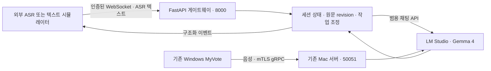

# 독립 ASR 텍스트 스트리밍 게이트웨이

이 문서는 `app/`의 별도 FastAPI 서비스를 설명한다. 기존 Mac 음성 서버의 원본 ZIP·모델·인증서·LM Studio 설정을 교체하는 문서가 아니다. 이 서비스는 운영을 고려한 출발점(`production-oriented baseline`)이며 운영 인증, 분산 처리 보장, 실영상 정확도 인증을 뜻하지 않는다.

## 서비스 경계

새 WebSocket은 **ASR 텍스트 입력**이며 PCM·WAV·마이크 오디오를 받는 ASR 서비스가 아니다. 화자와 전사 결과를 제공하는 외부 ASR은 호출자가 준비한다. 텍스트 모델이 음성 화자를 식별한다고 가정하지 않는다.

기존 Windows MyVote는 `50051`의 mTLS gRPC를 사용한다. 새 `8000` 포트를 열어도 자동 전환되지 않으며, 새 REST/WebSocket 계약을 구현한 클라이언트가 필요하다. 기존 서비스와 새 서비스는 같은 LM Studio를 공유할 수 있어 GPU·메모리·요청 용량 경쟁이 발생할 수 있다.

## 기존 설계의 수용·조정

| 항목 | 기존 음성 서버 | 새 텍스트 게이트웨이의 적용 범위 |
| --- | --- | --- |
| 오디오·전사 | 서버에서 ASR·VAD 수행 | 외부 ASR의 텍스트를 수신; 오디오 처리·모델 다운로드 없음 |
| 통신 | Windows 전용 gRPC·mTLS | 별도 REST/WebSocket·Bearer 인증; 공개 시 TLS 프록시 필요 |
| 화자 근거 | 음향 분석·겹침 분리 | 입력 메타데이터의 책임은 ASR 제공자; 음향 재확인을 대신하지 않음 |
| 번역 모델 | Gemma 선택 + TranslateGemma 전용 번역 형식 | 기본 범용 Gemma 4 채팅 백엔드; TranslateGemma 어댑터·모델 설정 변경 없음 |
| 원문 수정 | 기존 단어·자막 ID/revision 계약 | 새 프로토콜의 ASR 수정·결과 식별 계약 사용; 두 프로토콜 호환 아님 |
| 문맥·용어 | 기존 화자별 문맥·후속 검토 | 세션 단위로 관리; 세션 간 원문·용어 공유를 전제하지 않음 |
| 미완성 원문 | 품질 우선 선택·원문 보존 | 새 서비스 자체의 처리 정책으로 판단; 기존 12초/20초 정책이 자동 이식되는 것은 아님 |
| 작업 조정 | 기존 세션·화자별 큐 | 새 프로세스 내부 조정; 분산 큐·여러 worker 간 세션 공유 없음 |
| 영속성 | Windows 저장 기록 별도 | 서버 메모리 세션; 재시작 후 복구·영구 이력 저장을 보장하지 않음 |
| 성능 | 기존 합성 모델 진단 수치 있음 | 별도 측정 필요; 기존 README의 측정값을 새 API SLA로 사용하지 않음 |

세부 입력·출력과 재연결 규칙은 [프로토콜](streaming-protocol.md), 관리 API와 실행 방법은 [API 안내](streaming-api.md)를 따른다.

## 텍스트 처리 단계

| 단계 | 구현과 조정 |
| --- | --- |
| 전사 안정화 | 최근 4개 가설의 공통 접두부, 선택적 confidence·단어 유지 시간·정적을 조합한다. 타이머를 새 ASR 가설로 세지 않는다. 기본 `HOLD_PARTIAL_TAIL=true`에서는 구분자가 없는 마지막 partial 토큰을 보류해 `hosp`가 `hospital`로 늘어날 가능성을 보호한다. 이미 확정한 원문과 partial이 충돌하면 기다린다. |
| 의미 구간 후보 | 안정된 원문 안에서 정확한 원문 위치를 유지하며 완성된 연속 앞부분을 선택한다. 24개 로컬 토큰은 기본 구간 선호 크기다. `ALLOW_OVERSIZE_COMPLETE=true`에서는 첫 번째 명확한 완성 문장 전체가 이를 초과해도 원문·상태 크기 제한 안에서 허용한다. 미완성 첫 구절을 건너뛰거나 24토큰에서 강제로 자르지 않는다. |
| READ/WRITE | 완결성과 안정성을 먼저 확인한다. 기본 안정도 0.75·최소 안정 토큰 3·최소 구간 5·목표 10을 사용하지만 명확한 완성 문장·명령 경계는 짧아도 허용한다. 1500ms 목표나 ASR final만으로 미완성 구절을 WRITE하지 않는다. |
| 작업 배분 | 기본 4개의 비동기 작업 슬롯에서 세션 간 round-robin을 사용한다. 세션 하나의 실제 모델 작업은 하나씩 진행해 앞 결과를 다음 문맥에 반영한다. 대기 partial은 같은 구간의 최신 revision으로 합칠 수 있지만 수락한 final을 큐 압력 때문에 조용히 버리지 않는다. |
| 번역 확정 | 구간 전체를 draft로 표시하고 같은 결과의 안정성 관측 또는 기본 700ms 대기를 거쳐 commit한다. 번역문 공통 접두부를 원문 위치에 억지로 대응시키지 않는다. |
| ASR final 수정 | 변경이 처음 닿는 원문 구간부터 뒤 결과를 무효화하고 다시 처리한다. 결과 반영 시 generation·원문 revision·구간 소유권을 재검사해 오래된 응답을 막는다. |

이 토큰 수는 로컬 텍스트 분할 단위이며 LM 모델의 실제 tokenizer 토큰 수와 같다고 보장하지 않는다. 같은 세션 안에서 모델 작업을 여러 개 병렬 실행하는 설계는 채택하지 않았다. 취소를 무시하는 백엔드는 실제 반환까지 슬롯을 점유하며, 단순 취소 요청만으로 물리적 모델 용량이 반환됐다고 간주하지 않는다.

여기서 슬롯은 서버가 추적하는 비동기 백엔드 요청이다. HTTP 연결 취소가 추론 서버의 GPU 계산까지 즉시 중단한다는 보장은 없으며, 추론 서버의 취소·동시 처리 정책도 별도로 확인해야 한다.

완결성 게이트는 **영어·한국어의 보수적 휴리스틱**이며 기존 gRPC 서버의 Gemma 구간 판단을 호출하지 않는다. 서비스의 원문 언어는 `en`·`ko` 계열만 허용하고 다른 언어는 `UNSUPPORTED_SOURCE_LANGUAGE`로 명시적으로 거부한다. 목표 언어의 번역 가능 여부는 백엔드 능력에 달려 있다. 지원 언어에서도 알려지지 않은 문법에 과도하게 기다리거나 잘못된 완료 판정을 할 수 있다. 장문·드문 문법·잘못된 ASR 문장 부호에 대한 평가가 필요하다.

`SemanticSegmenter`와 `TranslationPolicy`는 교체 가능한 경계다. 다른 언어를 추가할 때는 검증된 분할기·정책을 구현해야 하며 원문 언어 코드만 바꾸어 영어 휴리스틱으로 처리하지 않는다. 더 기다리는 정책과 최종 미완성 원문 보존을 채택했지만 번역 품질을 인증한 것은 아니다.

## 인증과 세션 수명

`STREAMING_API_KEY`는 서버 관리용 키다. 세션 생성에는 관리 키를 사용하고, 생성 응답의 무작위 `session_token`은 해당 세션을 제어할 수 있는 별도 권한이다. 세션 REST와 WebSocket에는 해당 토큰을 사용한다. 토큰을 가진 사람은 그 세션에 접근할 수 있으므로 URL 쿼리·로그·공유 스크린샷에 넣지 않는다.

기본 상한은 동시 세션 32개, 세션 만료 1800초다. 세션은 프로세스 메모리에 있으므로 Uvicorn worker는 **1개**로 실행한다. 여러 worker·복제본을 켜면 요청이 다른 메모리 상태로 분산되어 세션 조회·WebSocket 재연결이 깨질 수 있다. 수평 확장이 필요하면 공유 세션 저장소, 소유권/잠금, 이벤트 보관, 복구 계약을 먼저 설계해야 한다.

WebSocket 단절과 세션 삭제는 같지 않다. 한 세션은 한 번에 WebSocket 하나만 연결한다. 유효한 세션은 다시 인증해 현재 스냅샷을 받을 수 있지만 이벤트 replay나 exactly-once 입력 전달은 지원하지 않는다. 서버가 결과를 보냈다는 사실은 클라이언트 화면 표시 완료를 뜻하지 않는다.

## 모델과 자원

기본 모델은 이미 로드된 `google/gemma-4-26b-a4b`이며 OpenAI 호환 `/v1/chat/completions`에 요청한다. 새 API를 실행해도 모델을 내려받거나 LM Studio의 로드·Thinking·문맥·병렬 설정을 바꾸지 않는다. TranslateGemma의 전용 입력 형식은 기존 서비스에 그대로 남는다.

세션 상한은 모델의 실제 동시 처리 능력이 아니다. 32개 세션이 허용된다고 32개 모델 요청을 동시에 처리할 수 있다고 해석하면 안 된다. HTTP 연결, 모델 요청 대기, 느린 WebSocket 소비자, 세션 메모리, LM Studio 용량을 함께 측정해야 한다. 모델 출력의 구조 검증은 번역의 의미 정확성을 증명하지 않는다.

## 배포와 운영 한계

기본 수신 주소는 `127.0.0.1:8000`이다. 원격 공개 시 TLS 종료 프록시, WebSocket 업그레이드 전달, 적절한 연결·프레임 제한, 접근 제어가 필요하다. `0.0.0.0` 바인딩은 암호화나 인증 강화를 의미하지 않는다. 관리 키·세션 토큰을 평문 HTTP로 신뢰하지 않는 네트워크에 보내지 않는다.

컨테이너는 API 코드만 포함하고 비루트 사용자로 실행한다. 기존 ASR, 모델, 인증서, 개인 키, `.env`, 음성 서버 가상환경은 이미지에 포함하지 않는다. Docker 실행은 현재 Mac 음성 서버나 LM Studio를 자동 시작·종료하지 않는다. Docker Desktop에서는 컨테이너의 `127.0.0.1`이 Mac 호스트가 아니므로 별도 호스트 모델 URL이 필요하다.

원문과 번역문을 기본 로그에 남기지 않는다. 프록시나 APM을 별도 설치할 때도 Authorization 헤더·WebSocket 인증 프레임·텍스트 본문 수집을 끄거나 엄격히 제한한다. `/metrics`는 운영 관측용이며 세션 원문을 제공하는 API가 아니다.

## 검증 범위

코드 회귀 검사는 입력 검증·인증·상태 전이·모델 오류·취소·자원 정리를 다루고, 시뮬레이터는 별도의 실제 API 연결을 확인한다. 합성 ASR 입력으로 성공해도 실제 음성 인식 품질이나 Windows 기존 앱의 동작을 검증한 것은 아니다.

새 ASGI 앱·임시 Uvicorn·HTTPX/WebSocket·실제 Gemma 4 경로에서 고정 final 입력 5건(단독 1건·동시 4건)의 성공을 확인했다. [실측 범위와 수치](streaming-api.md#새-api의-실제-모델-진단)를 참고한다. 임시 서버는 종료했고 8000번 상시 서비스는 실행하지 않았다.

소규모 진단이 지연·처리량 목표 달성이나 운영 승인을 뜻하지 않는다. 실제 ASR revision 패턴, 긴 세션, 느린 소비자, 모델 과부하, 네트워크 단절, 토큰 만료, 프로세스 재시작을 포함한 독립 검증이 필요하다.
